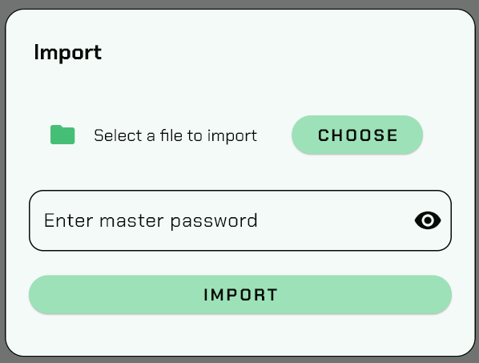
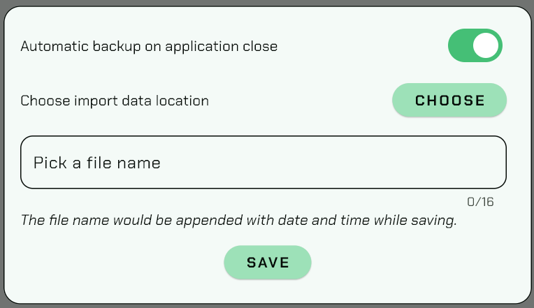
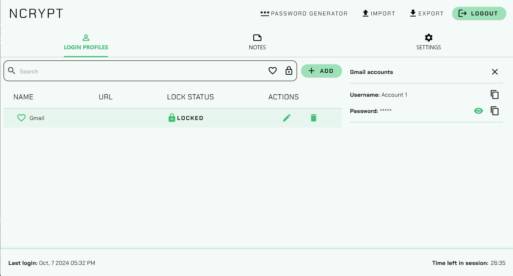
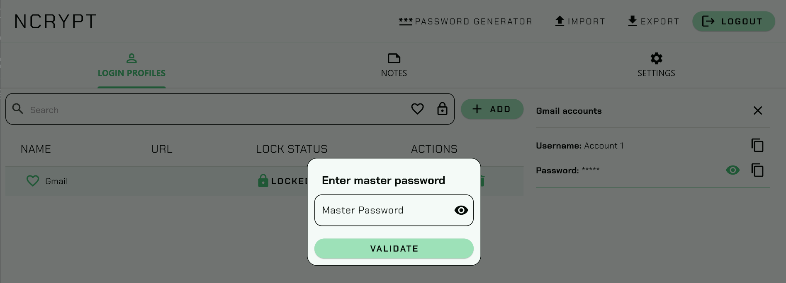
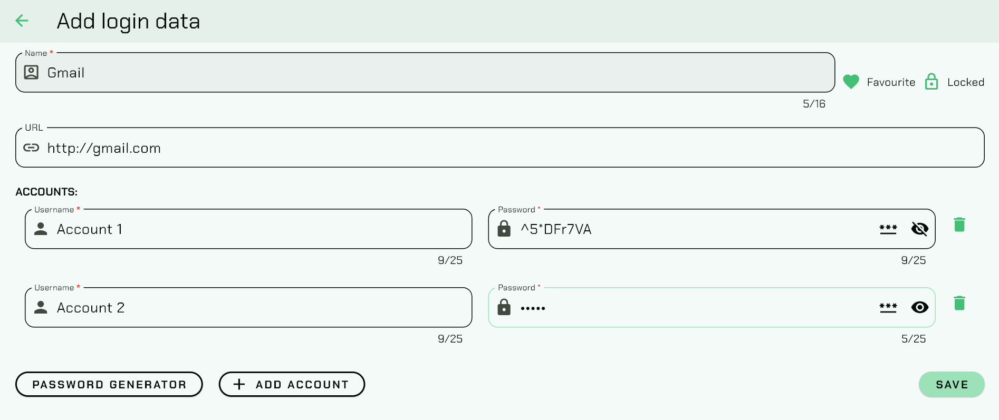
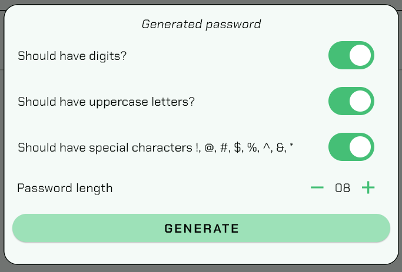

# Ncrypt

This is a desktop application built using flutter for managing passwords and secrets. All sensitive data are encrypted
using AES-encryption using Go and are stored as encrypted key-value pair.

Features:

- Ability to import and export data.
    - All stored data can be exported as a single encrypted file with _.ncrypt_ extension.
    - To import a _.ncrypt_ file user would be required to enter the master-password which was used when exporting.
      _**Caution**: Importing will completely overwrite existing
      data._

- Automatic backup.
    - If enabled in the setting, on logout and application close, an automatic backup will be performed to set location
      using given file_name appended with date-time stamp.

- Ability to lock data.
    - Locked data would require user to re-enter master password to view,edit and delete data.

- Supports multiple accounts.
    - Multiple accounts from a single website or app are grouped under single name.

- Password generator.
    - Users can set their preferences for generating password which will be used for generating password for accounts or
      in general help you with randomized password based on your preference.

App icon: <a href="https://www.flaticon.com/free-icons/security" title="security icons">Security icons created by

Freepik - Flaticon</a>

Thanks to:
- <a href="https://github.com/skandansn"> Skandan </a>
- <a href="https://github.com/shishirkallapur"> Shishir </a>
for their valuable inputs.
